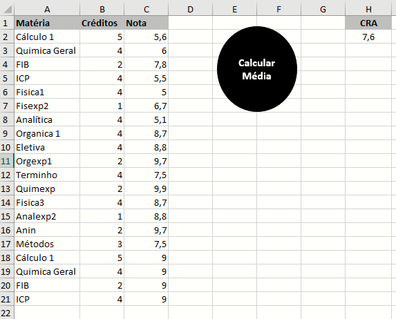
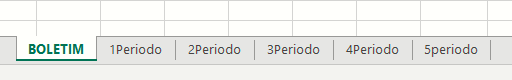
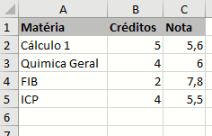

Sub Compilar()

    Dim ult_linha As Integer
    Dim prox_linha As Integer
    Dim x As Double
    Dim y As Double

'Primeiro procedimento é apagar a aba boletim, pois outros períodos podem ser atualizados ou adicionados

        Sheets("BOLETIM").Select
        If Range("A2").Value <> "" Then
        ult_linha = Range("A1048576").End(xlUp).Row
        Range(Cells(2, 1), Cells(ult_linha, 3)).Clear
    End If

'Agora o excel irá procurar em casa Aba os períodos adicionados com exceção da aba boletim

    For Each aba In ThisWorkbook.Sheets

        If aba.Name <> "BOLETIM" Then

            aba.Select
            ult_linha = Range("A1048576").End(xlUp).Row
            Range(Cells(2, 1), Cells(ult_linha, 3)).Select
            Selection.Copy

            Sheets("BOLETIM").Select
            prox_linha = Range("A1048576").End(xlUp).Row + 1
            Cells(prox_linha, 1).Select
            ActiveSheet.Paste
        End If
    Next
 

'Aqui irá calcular a média ponderada = Somar produto dos créditos X notas e dividir pelo somatório dos créditos
 
    Sheets("BOLETIM").Select
    x = WorksheetFunction.SumProduct(Range("B2:B100000"), Range("C2:C100000"))
    y = WorksheetFunction.Sum(Range("B2:B10000"))
    
    Range("H2").Value = x / y
    
    
   
    End Sub
